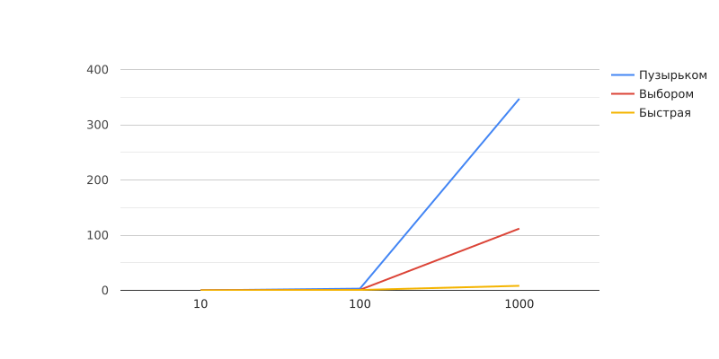

### Результат работы программы:
quick_sort for size 10 is 0.109673 \
selection_sort for size 10 is 0.059605 \
bubble_sort for size 10 is 0.059605

quick_sort for size 100 is 0.729561 \
selection_sort for size 100 is 0.979900 \
bubble_sort for size 100 is 3.089905

quick_sort for size 1000 is 8.201599 \
selection_sort for size 1000 is 111.868382 \
bubble_sort for size 1000 is 347.177982

### Визуализация:

### Вывод:
На небольших объемах данных алгоритмы отрабатывают практически одинаково, однако с ростом количества элементов в 
массиве, можно заметить, что алгоритмы с наименьшей сложностью затрачивают в разы меньше времени.
