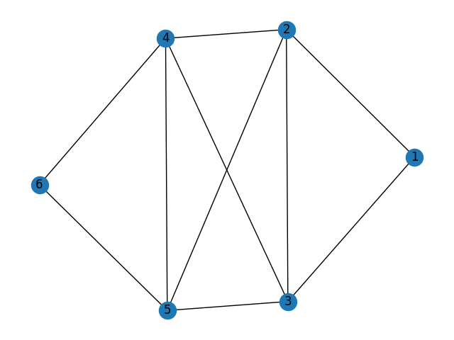

### Результат работы программы:
Эксцентриситет вершин: {1: 3, 2: 2, 3: 2, 4: 2, 5: 2, 6: 3} \
Степени вершин: [(1, 2), (2, 4), (3, 4), (4, 4), (5, 4), (6, 2)] \
Матрица смежности: \
[[0 1 1 0 0 0] \
 [1 0 1 1 1 0] \
 [1 1 0 1 1 0] \
 [0 1 1 0 1 1] \
 [0 1 1 1 0 1] \
 [0 0 0 1 1 0]] \
Матрица инцидентности: \
[[1. 1. 0. 0. 0. 0. 0. 0. 0. 0.] \
 [1. 0. 1. 1. 1. 0. 0. 0. 0. 0.] \
 [0. 1. 1. 0. 0. 1. 1. 0. 0. 0.] \
 [0. 0. 0. 1. 0. 1. 0. 1. 1. 0.] \
 [0. 0. 0. 0. 1. 0. 1. 1. 0. 1.] \
 [0. 0. 0. 0. 0. 0. 0. 0. 1. 1.]] \
Радиус: 2 \
Диаметр: 3 \
Центр: [2, 3, 4, 5] \
Список циклов, образующих базис циклов графа: [[4, 5, 6], [2, 3, 5], [4, 3, 5], [2, 1, 3], [4, 2, 5]] \
Набор рёбер минимальной кардинальности для разделения графа: {(1, 2), (1, 3)} \
Набор вершин минимальной кардинальности для разделения графа: {4, 5}

### Визуализация:

